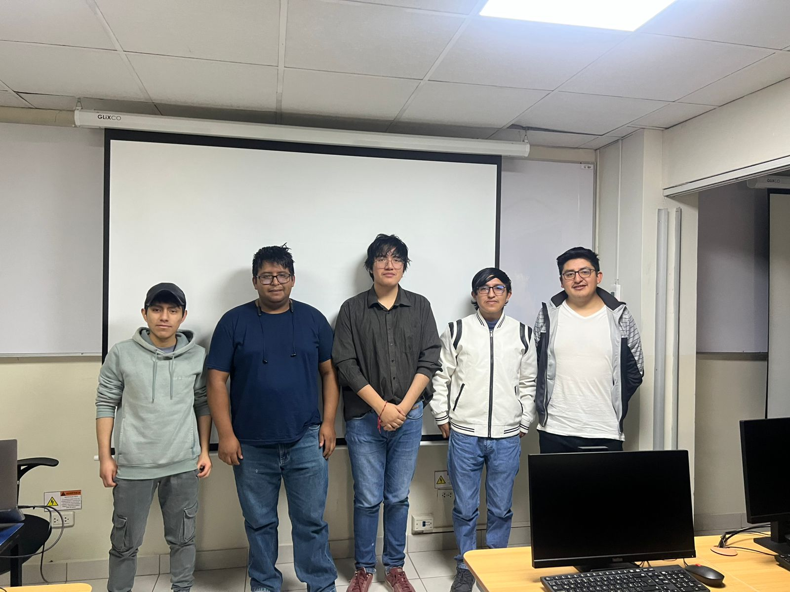

# Sistema de Generacion Optima de Horarios Academicos en Entornos de Curriculo Flexible

-blue)
-blueviolet)


## 👥 Equipo de Trabajo



**Integrantes del Proyecto:**
- Bonifacio Rojas, Marlon
- Espíritu Campos, Alejandro
- Fernández Durán, Rafael
- Guzmán Choque, Fabián
- Quispe Campos, Luis Enrique

## 🎥 Video Demostrativo

[](https://youtu.be/fatllT9Y3DI)

*([descargar o ver el archivo .mp4 original aquí](docs/Otros/Proyecto/video_proyecto.mp4)).*

El sistema genera, valida, mide y recomienda. No reemplaza totalmente la intervencion humana: coordinadores, responsables de horarios, docentes y registro academico conservan la revision de excepciones, aprobacion final y control de cambios.

---

## 📑 Índice

1. [Descripción General](#1-descripción-general)
2. [Problemática Abordada](#2-problemática-abordada)
3. [Objetivo del Proyecto](#3-objetivo-del-proyecto)
4. [Equipo de Trabajo y Roles](#4-equipo-de-trabajo-y-roles)
5. [Estado Actual](#5-estado-actual)
6. [Estructura del Repositorio](#6-estructura-del-repositorio)
7. [📚 Documentación del Proyecto](#7--documentación-del-proyecto)
8. [🚀 Guía Rápida de Inicio](#8--guía-rápida-de-inicio)

(Evaluación de GreenSoftware en las ramas test-greensoftware y test-greensoftware-mejoras)

La planificacion academica flexible combina demanda de cursos, docentes, aulas, cupos, disponibilidad, secciones y restricciones de horario. Sin apoyo tecnico, el proceso puede generar cruces, sobreuso de aulas, baja trazabilidad y dificultad para justificar decisiones academicas.

## 1. Descripción General
Este repositorio corresponde al proyecto universitario desarrollado en el curso **Taller de Proyectos 2**. El propósito principal es desarrollar un sistema funcional con una organización adecuada del repositorio, consolidando la documentación y la base para el trabajo colaborativo del equipo.

El contenido está orientado a la definición del problema, la visión del proyecto, la organización documental y la implementación de requerimientos funcionales y no funcionales.

## Alcance futuro

- Planificacion curricular completa por carrera, plan y ciclo.
- Estimacion formal de demanda academica.
- Student sectioning o asignacion de estudiantes a secciones.
- Persistencia historica de KPI.
- Flujo formal de aprobacion, publicacion y cambios controlados.
- Autenticacion, roles, auditoria y exportaciones institucionales.

## Tecnologias reales

| Capa | Tecnologia |
|---|---|
| Backend | Node.js, Express, CommonJS |
| Base de datos | MySQL, `mysql2/promise` |
| Frontend | React, Vite |
| Pruebas | `node:test` |
| Documentacion | Markdown |

## 3. Objetivo del Proyecto
Desarrollar una propuesta orientada a la generación óptima de horarios académicos en entornos de currículo flexible, considerando las restricciones académicas y operativas identificadas.

El objetivo general es implementar un sistema completo y robusto para la resolución automatizada de horarios, mediante el uso de heurísticas y reglas de negocio adaptables, facilitando la gestión del entorno académico.

## Modulos principales

| Modulo | Archivo principal | Estado |
|---|---|---|
| API backend | `backend_node/server.js` | CRUD y endpoint de generacion. |
| Orquestador | `backend_node/GeneratorService.js` | Conecta datos MySQL con el motor CSP. |
| Motor CSP | `backend_node/src/services/CSPMotor.js` | Algoritmo Fast Greedy con generación de múltiples alternativas interactivas. |
| Motor Anti-Cruces HU03 | `backend_node/src/services/motorAntiCruces.js` | Validacion de cruces, advertencias y metricas. |
| Pruebas HU03 | `backend_node/tests/motorAntiCruces.test.js` | Pruebas unitarias con `node:test`. |
| Frontend | `frontend/src/` | Gestion y visualizacion base. |

## Documentacion principal

- [Indice documental](docs/README.md)
- [Vision general](docs/inicio/01_vision_general.md)
- [Mapa del proceso academico](docs/inicio/02_mapa_proceso_academico.md)
- [Requerimientos](docs/inicio/03_requerimientos.md)
- [Supuestos y restricciones](docs/inicio/04_supuestos_y_restricciones.md)
- [SDD](docs/sdd/README.md)
- [Ejecucion y evidencias](docs/ejecucion/README.md)
- [Seguimiento y control](docs/seguimiento_control/README.md)
- [Calidad y auditoria AT002](docs/Otros/calidad/README.md)
- [Capacitacion y transferencia](docs/Otros/capacitacion/README.md)
- [Control y cierre](docs/cierre/README.md)
- [Investigacion base](docs/Otros/referencias/01_investigacion_base.md)

## 5. Estado Actual y Cierre
El proyecto ha completado su fase de desarrollo activo del prototipo y se encuentra en etapa de **Control y Cierre**. Se ha consolidado un núcleo funcional que permite:

- **Generación de horarios:** Mediante un motor de optimización CSP (Fast Greedy) capaz de generar múltiples alternativas (opciones) de horarios para facilitar la toma de decisiones.
- **Validación anti-cruces:** Implementación de reglas y restricciones comprobadas mediante pruebas (HU03).
- **Gestión frontend/backend:** Integración con API REST (Node.js) y visualización en React.
- **Trazabilidad y Calidad:** Ejecución del 100% del tiempo estimado (13 semanas), cumplimiento estricto del presupuesto (S/ 11,706) y documentación exhaustiva (incluyendo actas de cierre, SDD y registros de riesgos).

```bash
cd backend_node
npm install
node init_db.js
node seed_db.js
node server.js
```

Backend por defecto:

```text
.
|-- README.md
|-- backend_node/            # Componente de lógica, servicios y orquestación
|   |-- src/
|   |-- tests/               # Pruebas unitarias e integración
|   `-- seed.js              # Datos simulados (Seeds)
|-- docs/                    # Documentación principal del proyecto
|   |-- README.md            # Índice documental
|   |-- cierre/              # Entregables y actas de cierre
|   |-- ejecucion/           # Evidencias, métricas y TDD
|   |-- inicio/              # Vision, requerimientos y supuestos
|   |-- Otros/               # Referencias, capacitación y calidad
|   |-- sdd/                 # Documento de Diseño de Software (SDD)
|   `-- seguimiento_control/ # Registros de riesgos, incidentes y trazabilidad
|-- e2e/                     # Pruebas End-to-End (Playwright)
`-- frontend/                # Componente de interfaz de usuario (React/Vite)
    `-- src/
```

## Ejecucion del frontend

```bash
cd frontend
npm install
npm run dev
```

Frontend por defecto:

```text
http://localhost:5173
```

## Pruebas disponibles

Pruebas unitarias actuales de HU03:

```bash
cd backend_node
npm.cmd test
```

La cobertura de pruebas dinámicas en componentes críticos (ej. Motor Anti-Cruces HU03 y API) alcanza el 85%, validable mediante los scripts integrados, con la deuda de calidad estática documentada para su corrección futura.
